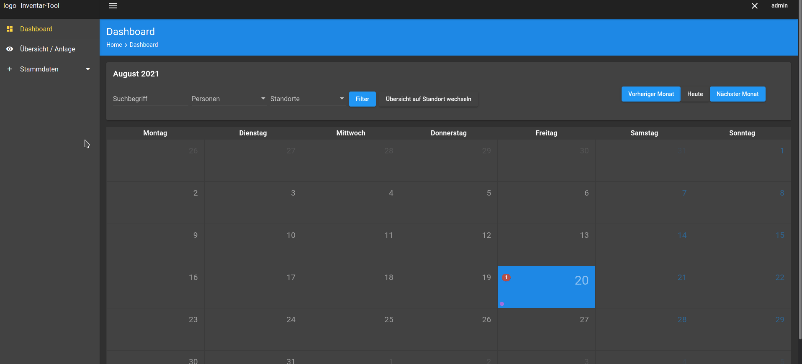

# Miniature Asset Manager Frontend

A frontend for the [Miniature Asset Manager](https://github.com/mbattista/miniature-asset-manager).

### Technology
- Angular frontend with Material Design

### ToDos
- [ ] Clean up the Code and add Comments
- [ ] Implement Tests 
- [ ] Add install information in the README
- [ ] Create a docker-compose which includes backend and frontend
